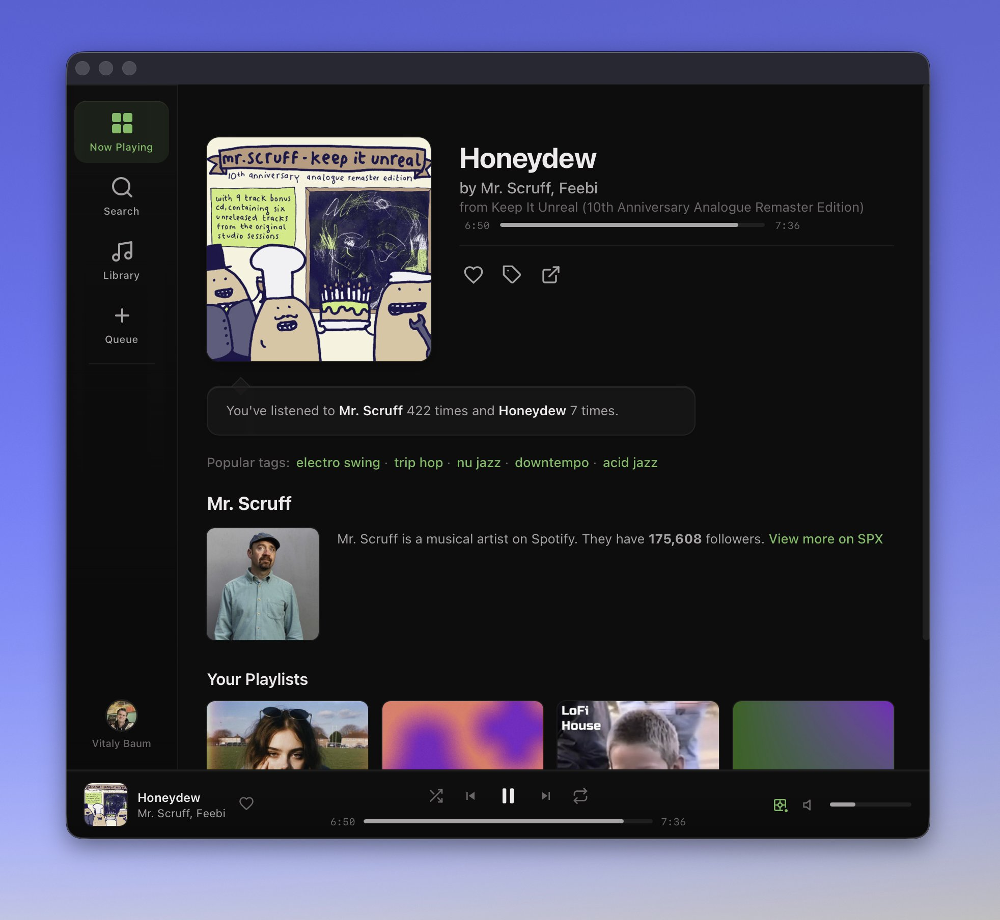

# SPX

### *The child of Spotify and Last.fm 2009* 💀

**SPX** is a retro-styled Spotify remote control for macOS, built with a web frontend and a native Rust backend.



---

## Why SPX?

| Problem | Solution |
|---------|----------|
| Spotify desktop is heavy | Lightweight Tauri shell + local WebSocket backend |
| No scrobble counts | Real play counts, listening history |
| Clunky UI | Dark liquid-glass, keyboard-first |
| Can't develop offline | Built-in **mock mode** |

---

## Features

- **Playback:** Full control, Spotify Connect, queue management
- **Library:** Search, browse, home recommendations
- **Stats:** Play counts, listening history
- **UI:** Liquid-glass dark theme, native macOS titlebar, keyboard shortcuts
- **Dev:** Mock mode, hot reload, zero Spotify account needed
- **Local devices:** mDNS discovery and Google Cast wake-up
- **macOS Integration:** Global media keys, Now Playing on lock screen
- **Error Handling:** Comprehensive error messages with solutions

---

## Screenshots

| | |
|---|---|
|  |  |
|  |  |

---

## Requirements

- macOS 14.0+ (Sonoma or later)
- [Node.js](https://nodejs.org/) 18+
- [Rust](https://rustup.rs/) 1.77+
- A Spotify Premium account (for remote playback control)
- A Spotify app/client ID for OAuth

---

## Quick Start

```bash
# Install dependencies
npm install

# Set your Spotify Client ID
export SPOTIFY_CLIENT_ID=your_client_id_here

# Run the app
npm run tauri dev
```

### Mock Mode (no Spotify account)

```bash
./dev.sh network:mock
# or
VITE_SPX_MOCK=1 npm run dev
```

### Production Build

```bash
npm run tauri build
./launch_spx.sh
```

---

## Spotify OAuth Setup

SPX uses **librespot OAuth** (the same proven flow as `spotify-player`) to authenticate and cache credentials locally.

1. Create an app at [developer.spotify.com/dashboard](https://developer.spotify.com/dashboard)
2. Add `http://127.0.0.1:1422/callback` to your app's Redirect URIs
3. Copy `.env.example` to `.env` and fill in your credentials:

```bash
cp .env.example .env
# Edit .env with your SPOTIFY_CLIENT_ID and SPOTIFY_CLIENT_SECRET
```

Or set environment variables:

```bash
export SPOTIFY_CLIENT_ID=your_client_id
export SPOTIFY_CLIENT_SECRET=your_client_secret
npm run tauri dev
```

---

## Stack

| Layer | Tech |
|-------|------|
| Runtime | Tauri 2 (Rust) |
| UI | Preact 10 + TypeScript |
| Build | Vite 5 |
| Backend | Rust + Tokio + WebSocket |
| Spotify API | librespot OAuth + rspotify Web API |
| Local devices | mDNS + Google Cast V2 |
| Testing | Vitest + Playwright |

---

## Project Structure

```
.
├── src/                  # Preact frontend
│   ├── components/       # UI components
│   ├── screens/          # Page-level screens
│   ├── stores/           # Preact Signals state
│   ├── hooks/            # Shared hooks
│   ├── lib/              # API client, cache, errors, etc.
│   └── styles/           # CSS styles
├── src-tauri/            # Rust Tauri backend
│   ├── src/              # Rust source
│   ├── capabilities/     # Tauri permissions
│   ├── icons/            # App icons
│   └── Cargo.toml
├── scripts/              # Build scripts
├── dev.sh                # Development script
├── launch_spx.sh         # Launch bundled app
└── package.json
```

---

## Hotkeys

| Key | Action |
|-----|--------|
| `Cmd + 1` | Now Playing |
| `Cmd + 2` | Search |
| `Cmd + 3` | Library |
| `Cmd + 4` | Queue |
| `Space` | Play / Pause |
| `Cmd + ←` | Previous track |
| `Cmd + →` | Next track |
| `Cmd + ↑` | Volume up |
| `Cmd + ↓` | Volume down |
| `S` | Toggle shuffle |
| `R` | Cycle repeat (off → context → track) |
| `M` | Mute / unmute |
| `/` | Focus search |
| `?` | Hotkey help |
| `Esc` | Close / go back |

Shortcuts are disabled while typing in inputs.

---

## Error Handling

SPX provides comprehensive error handling with user-friendly messages and step-by-step solutions:

- **Authentication errors:** Token expired, OAuth failed, Premium required
- **Network errors:** Connection lost, timeout, rate limited
- **Device errors:** No devices found, Spotify closed, different WiFi
- **Playback errors:** Region blocked, explicit content, ads playing

Errors appear as toast notifications with expandable solution steps.

---

## Development Scripts

| Command | Description |
|---------|-------------|
| `./dev.sh dev` | Run Tauri native app |
| `./dev.sh frontend` | Run Vite dev server only |
| `./dev.sh backend` | Run Rust WebSocket backend only |
| `./dev.sh network:mock` | Browser mode with mock data |
| `./dev.sh network:real` | Browser mode with real Spotify API |
| `./dev.sh build` | Build production .app bundle |
| `npm test` | Run Vitest unit tests |
| `npm run test:typecheck` | Type-check test files |
| `./launch_spx.sh [path/to/SPX.app]` | Launch built app |

---

## Testing

```bash
# Unit tests
npm test

# TypeScript type check
npm run test:typecheck

# End-to-end smoke tests (requires running dev server)
./dev.sh network:mock
npm run test:e2e:mock
```

---

## macOS Permissions

The app requests the following entitlements:

- Outbound network connections (Spotify API)
- Inbound network connections (OAuth callback server)
- Bonjour/mDNS and local network multicast (Cast device discovery)
- Global media keys
- Now Playing info center

---

## Contributing

Mock mode works without Spotify credentials. Issues and PRs welcome.

**Made for music obsessives. Scrobble on.** 💀

---

## License

MIT
